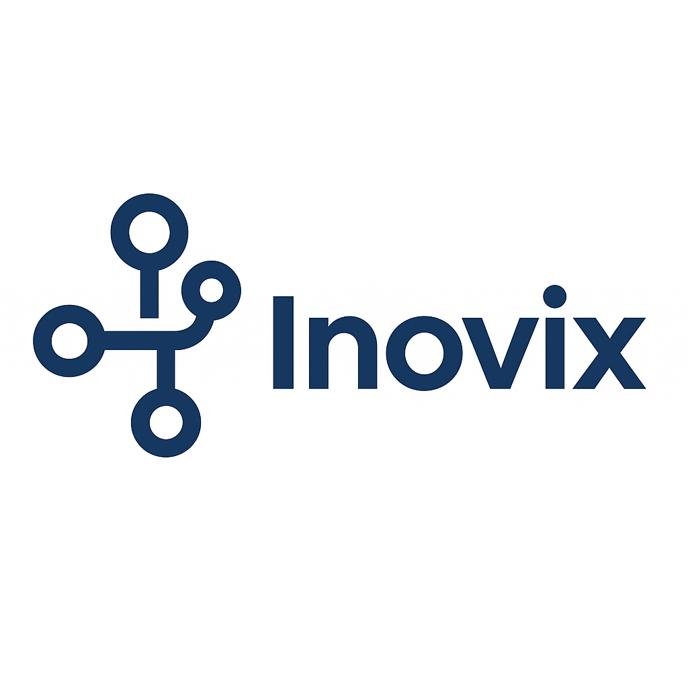

<!-- Banner Animado -->

# 👋 Olá! Eu sou o Vitor Hugo

Sou **desenvolvedor web em formação** e estou em constante evolução para me tornar **Full Stack**.  
Atualmente aprendendo **Node.js, Angular e Flutter**.  
Busco criar projetos reais e soluções criativas!

---

## 🚀 Tecnologias que uso

---

## 📌 Projetos em Destaque

| 📱 **ClikFood** | 🌐 **Inovix - Empresa Tech** |
|-----------------|-----------------------------|
| Aplicativo de delivery inspirado no Deliveroo. | Agência de tecnologia e marketing digital. |
| 
 |  |
| [🔗 Ver projeto](https://github.com/vitorgomesc/clikfood_app) | [🔗 Ver projeto](https://github.com/vitorgomesc/inovix_site) |

---

## 📊 Estatísticas do GitHub

  

---

## 🌎 Conecte-se comigo

---

### 👀 Visitantes do perfil

---

<!-- Rodapé animado -->

